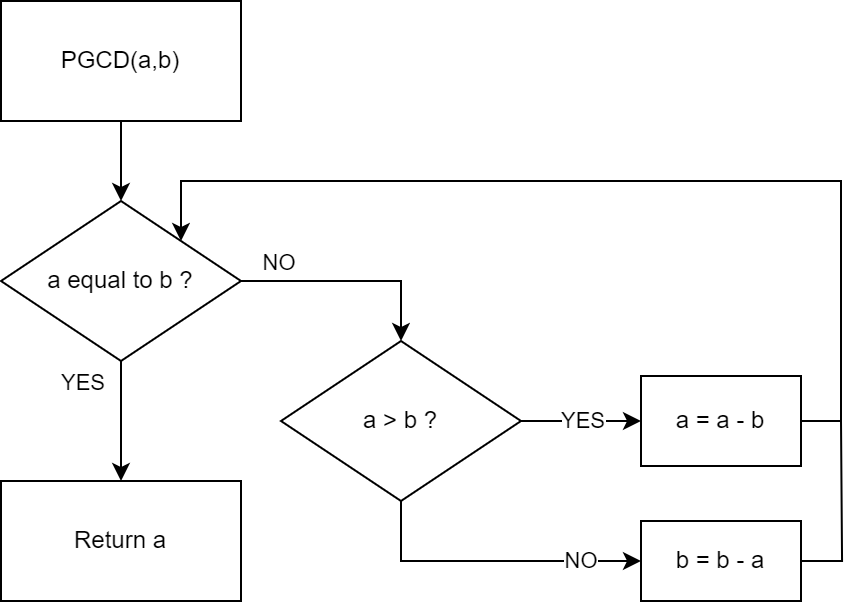

# GCD (Euclidean algorithm)

This program calculates the greatest common divisor (GCD or PGCD in French) of two numbers.

## Algorithm

    fonction euclide(a, b)
        tant que a ≠ b
            si a > b alors
                a := a − b;
            sinon
                b := b − a;
        renvoyer a;

## Usage

You can directly run the pre-compiled binary `pgcd.bin`. For more options, look at the [simulator documentation](../../ISS/README.md#usage).

    ./ISS/build/src/zimji TEST/pgcd/pgcd.bin

The program will ask you to input two integers, one at a time:

    [SCALL] Enter a number:
    20
    [SCALL] Enter a number:
    30
    [SCALL] R1 value: 10 (0x0000000a)